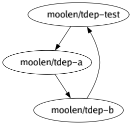

# tfe-dep

Analyzes terraform cloud cross-workspace dependencies.

## Problem statement

- dependency graph across workspaces is unclear
- no visiblity of dependencies
- unclear ordering of tf runs

### Usage

You must provide an `TFE_TOKEN` environment variable that contains the [Terraform Cloud API token](https://www.terraform.io/cloud-docs/users-teams-organizations/api-tokens).


#### Plot

The cli can analyze the dependencies and plot the information as png:

```
$ export TFE_TOKEN=....
$ tfe-dep plot --organization moolen --workspace tdep-test
INFO[0001] working on moolen/tdep-test:b6ddd5f6-5bcf-45c1-abe4-b89b29be67f8
INFO[0001] pointing to remote state at moolen/tdep-a
INFO[0001] working on moolen/tdep-a:0164c2d5-bdf7-2ffb-067f-09f0120e5820
INFO[0001] pointing to remote state at moolen/tdep-b
INFO[0002] working on moolen/tdep-b:53dfc25e-b10c-0d56-9004-1b34c4d56b2e
INFO[0002] pointing to remote state at moolen/tdep-test
ERRO[0002] circular dependency: moolen/tdep-b -> moolen/tdep-test
INFO[0002] pointing to remote state at moolen/tdep-a
INFO[0002] pointing to remote state at moolen/tdep-b
INFO[0002] pointing to remote state at moolen/tdep-test
INFO[0002] rendering graph
```



#### JSON
The cli can spit out json for your convenience:
```
$ tfe-dep json --organization moolen --workspace tdep-test | jq
{
  "workspace": "tdep-test",
  "organization": "moolen",
  "dependencies": [
    {
      "workspace": "tdep-a",
      "organization": "moolen",
      "dependencies": [
        {
          "workspace": "tdep-b",
          "organization": "moolen",
          "dependencies": [
            {
              "workspace": "tdep-test",
              "organization": "moolen",
              "dependencies": null
            }
          ]
        }
      ]
    }
  ]
}
```

#### Reconciler
Analyzes the dependencies of a given workspace and creates run triggers from it.
Note: this is limited to 20 RunTriggers per workspace.

Also: you can not create run trigger loops, tf cloud api prevents that.

#### Orchestrator

The orchestrator component runs a webhook that is notified when a terraform plan
has happened. It has knowledge of the dependencies of all workspaces and trigger tf runs for dependents.

### Roadmap

- [ ] Orchestrator: When a Workspace has been applied the orchestrator should get
      notified, analyze the dependencies and trigger a plan/apply run for them.
  - [ ] webhook component: receive notifications from tf cloud.
  - [ ] persistent queue / data storage: fault tolerant, consistent. Stores the
        dependency graph and keeps track of which workspaces have been planned/applied yet.
  - [ ] config: auto-apply plans or manual approval?
  - [ ] config: lock/unlock workspaces?
  - [ ] config: who configures the webhooks? this application itself?
        see: https://www.terraform.io/cloud-docs/api-docs/notification-configurations